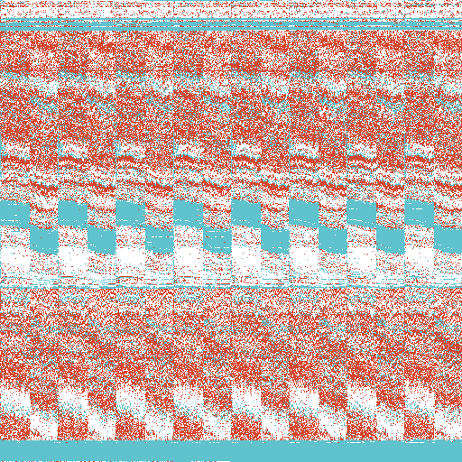
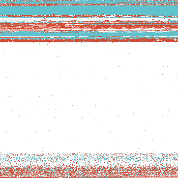
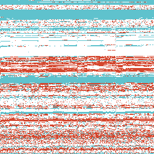
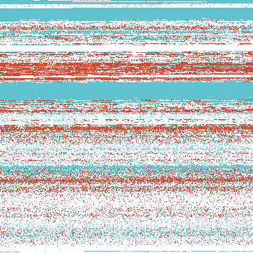
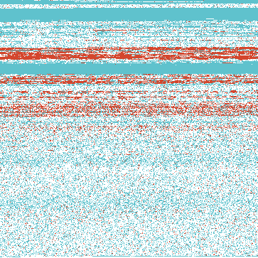

# Memory Visualizer

William CLOT & Camille PLAYS

*Forensics* | 2018

**F1**: Write a tool to visualize the content of a memory dump as a PNG picture. Each pixel represents one page of physical memory, and its color represent if it is associated to the kernel, to a userspace application, or if it is not used. In this last case, maybe two different shades could be used to differentiate pages that contain only zeros from pages that contain data.

**Nota Bene**: our tool only works with windows dump files as our volatility plugin was written to implement this on windows only (for the moment).

The plugin that we wrote doesn’t support non windows profiles. When we use our plugin with a created linux profile there is an error stating that `“This command (ie our plugin) does not support the profile”`. We didn’t have time to dig in to this more but it should come from the fact that we import `taskmods` and we use a `DllList` to compute all the current processes (and this command is only meant to work on windows systems). 

**Prerequisite**: You will need to have pillow and numpy to run the tool and all the libraries needed to run volatility (Distorm3, Yara and PyCrypto).

## How to use our tool to visualize memory dumps:

It's quite simple just execute the `visualizer.sh` with the *dumpfile* as first argument and the *volatility_profile* as second like so:

```bash
$ ./visualizer.sh <dumpfile> <volatility_profile>
```

If you don't know what profile to use just type:

```bash
$ ./visualizer.sh <dumpfile>
```

And this will run volatility with the `imageinfo` plugin to determine which profile to use (and make sure that all the libraries needed to run volatility are present).

```bash
$ ./visualizer.sh dumps/sample001.bin

Volatility Foundation Volatility Framework 2.6
INFO    : volatility.debug     : Determining profile based on KDBG search...
          Suggested Profile(s) : WinXPSP2x86, WinXPSP3x86 (Instantiated with WinXPSP2x86)
                     AS Layer1 : IA32PagedMemory (Kernel AS)
                     AS Layer2 : FileAddressSpace (/Users/williamclot/...)
                      PAE type : No PAE
                           DTB : 0x39000L
                          KDBG : 0x8054cde0L
          Number of Processors : 1
     Image Type (Service Pack) : 3
                KPCR for CPU 0 : 0xffdff000L
             KUSER_SHARED_DATA : 0xffdf0000L
           Image date and time : 2012-11-27 01:57:28 UTC+0000
     Image local date and time : 2012-11-26 19:57:28 -0600

Please reuse this tool with one of the Suggested Profile(s) above as argument
```


## Some example of output files:

Here is a few examples of images generated from some memory dumps. You can access these dumps by reading the README in dumps folder. Light blue pixels corresponds to kernel pages. Light red pixels corresponds to user pages.

Pixels are arranged from left to right and from top to bottom. The first page of the RAM with physical address 0x0000000 is at the top left corner of the image.

Win7SP1x86_23418:



Win2003SP0x86:



WinXPSP2x86

    

WinXPSP2x86_2

    

WinXPSP2x86_3

    

WinXPSP2x86_4

    

## How this tool works:

Our tools uses Volatility to find information in the dump file. As no existing plugins were ideal for this F1 task we decided to write our own plugin `memoryvisualizer.py` that can be found in the plugins folder:

```python
import volatility.win32.tasks as tasks
import volatility.plugins.taskmods as taskmods
import volatility.commands as commands
import volatility.utils as utils

class MemoryVisualizer(taskmods.DllList):
    """A step of F1 forensics project: Reads the pages of the memory dump
    and calculate the physical address and see if it belongs to kernel space"""

    def __init__(self, config, *args, **kwargs):
        taskmods.DllList.__init__(self, config, *args, **kwargs)
        self.config = config

    def calculate(self):
        """Returns a list of addresses of pages used by processes"""
        tasks = taskmods.DllList.calculate(self)
        for task in tasks:
            if task.UniqueProcessId:
                procSpace = task.get_process_address_space()
                pages = procSpace.get_available_pages(True)
                for p in pages:
                    yield p[1], procSpace.vtop(p[1]), p[2], procSpace.is_supervisor_page(p[0])

    def render_text(self, outfd, data):
        """Displays all the pages used by all processes"""
        for virtual, physical, size, kernel in data:
            print virtual, physical, size, kernel
```

This plugin loops through all the processes. For each process it will find the process address space and then the process pages. Once we have the pages we display the address of the page (Virtual), the phyical address (using the `vtop()` function), the size of the page (usually 4096 bits) and a boolean that indicates is the page is kernel space or user space (using the `is_supervisor_page()` function).

All the documentation on these functions can be found [here](http://volatilityfoundation.github.io/volatility/dc/d4c/classvolatility_1_1plugins_1_1addrspaces_1_1paged_1_1_abstract_paged_memory.html).

The output of this plugin will be like so:

```bash
$ vol.py -f dumpfile --profile=profile memoryvisualizer

(Virtual)   (Physical)    (Size)    (Kernel)
----------------------------------------------
0x0000000   0x0000000     0x1000    True/False
```


Once we have this plugin we can just pipe out all this information in a file and then exploit it inside another python program that will convert this data to the png image. This second program is called `imagegenerator.py` and is in the root of the project, it opens up the datafile and creates a numpy array a files the array with the corresponding values (red for user space and blue for kernel space).

The `visualizer.sh` is just a simple bash script that checks the arguments and launches other scripts.

## Useful links

- http://s3.eurecom.fr/~balzarot/forensics_projects_ideas.html
- https://github.com/504ensicsLabs/LiME
- https://github.com/volatilityfoundation/volatility
- http://volatilityfoundation.github.io/volatility/dc/d4c/classvolatility_1_1plugins_1_1addrspaces_1_1paged_1_1_abstract_paged_memory.html
- http://cyberfibers.com/2014/05/volatility-profiles/
- https://www.memoryanalysis.net/amf
